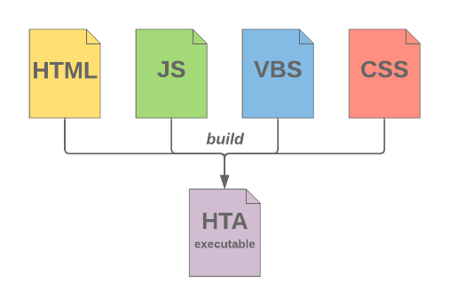
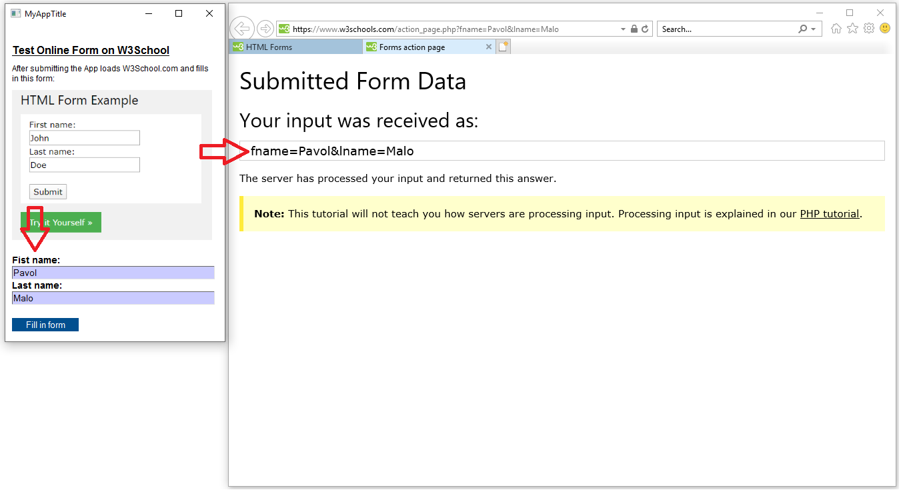

# HTA builder
This application automates the assembly of an HTML-Application into a single file: 

This App was produced as a side product during my master degree studies of Software Design and Engineering at [University of Applied Sciences FH Campus Wien](https://www.fh-campuswien.ac.at/en/studies/study-courses/detail/software-design-and-engineering-master.html).

## Prerequisites
In Windows .hta-files are executable without any prerequisites. HTA uses however the Internet Explorer's engine to render the GUI. Internet Explorer is still being issued with Windows OS. 

## Execution
The "MyApp.hta" in "Build"-directory is built with every initiation of the "buildAndTest.hta" in "DevFiles"-directory. Windows provides error messages if the code can not be interpreted, which can be useful for debugging.  

Additionally, this app includes a small demo of taking user input and filling online forms:  

Note: Error handling is not included. You may need to enable pop-ups and/or accept cookies for W3School.com in Internet Explorer manually before the application can run as intended. 

## Is HTA a good idea?
Short answer: No.

As apparent in the [Microsoft's Introduction to HTML Applications](https://docs.microsoft.com/en-us/previous-versions/ms536496%28v%3dvs.85%29), which has not been maintained since 2013, HTA is qiute old technology. Needless to say that since it overpasses the security constraints of an internet browser and is executable as a plain text file under Windows, its use is rather avoided due to security concerns. Additionally, there is no straight forward way for version management - put otherwise, it is not a good way to deploy a local system application.        

Long answer: Sometimes.

Nevertheless the above mentioned, when working not as a software developer, but in a specialized field (such as finance) where no development environment is available and all you have is Notepad and a problem to solve, an HTA just may do the job. Since it can access any local file and run with JavaScript, there is hardly an analytical task you would not be able to execute.   

## License
This application is released under the BSD license. 
